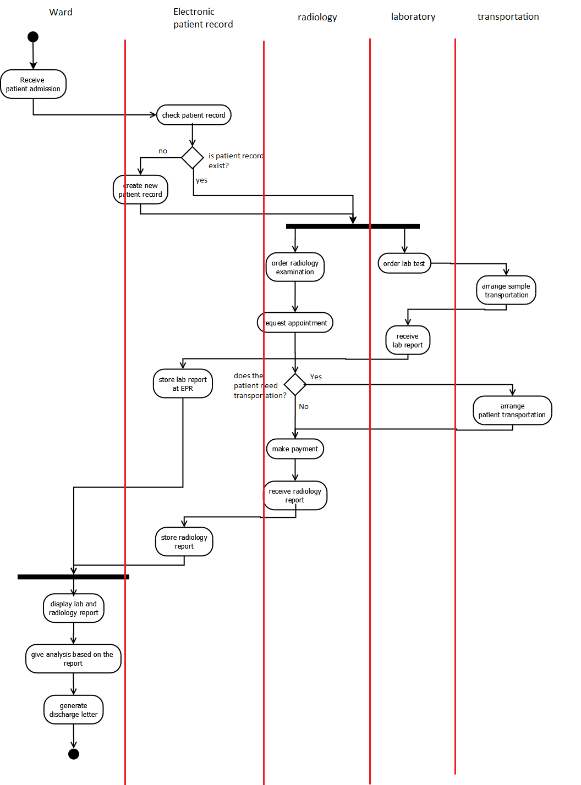

# Service-oriented Architecture with Web Services: The Project

## Introduction

This is the project deliverable for course [_Service-oriented Architecture with Web Services_](https://osiris.utwente.nl/student/OnderwijsCatalogusSelect.do?selectie=cursus&cursus=192652150&collegejaar=2013&taal=en) academic year 2014-2015.

## The Objective

To define and implement a WS-BPEL process that standardizes the flow of patient treatment activities in a hospital. This process shall be modelled and implemented from the perspective of a ward, which first admits a patient and then coordinates the treatment of his process as a process. As can be seen in the figure above, there are five entities/services involved.

## Tools used

Eclipse, Apache Tomcat, Apache ODE Engine,

## Solution Overview

The activity diagram is depicted as the following:

The partner link definition:

BPEL process:

## Deliverables

- [Report](report/)
- [Laboratory service](Laboratory/)
- [LaboratoryCallback service](LaboratoryCallback/)
- [PatientService](PatientService/)
- [Radiology Service](Radiology/)
- [RadiologyCallback service](RadiologyCallback/)
- [Transportation service](Transportation/)
- [Ward-client](Ward-client/)
- [Ward service](Ward_v2/)
